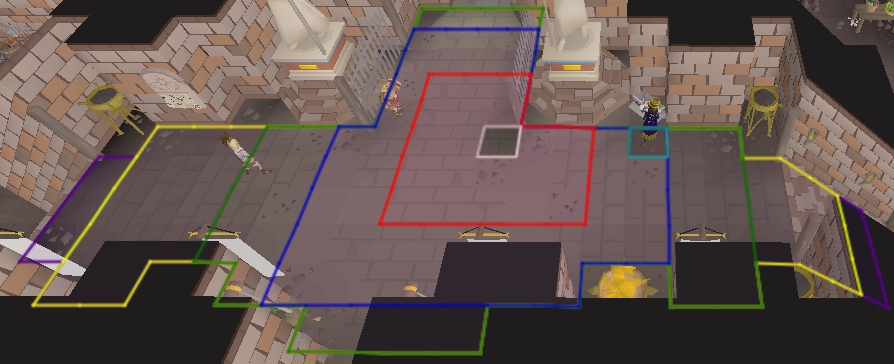
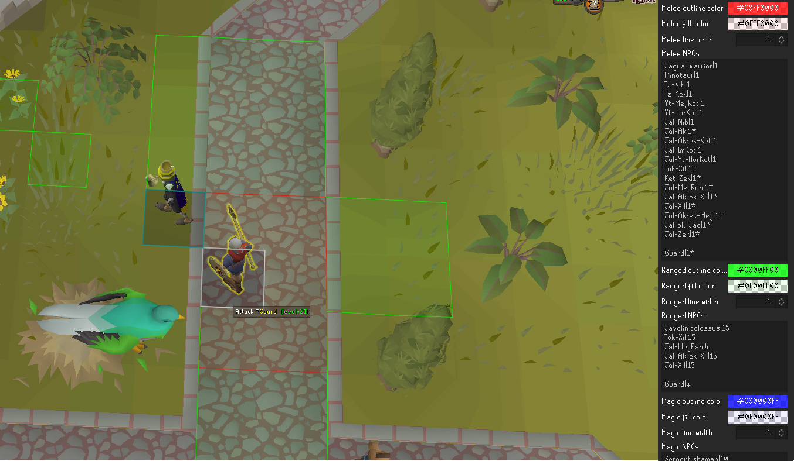
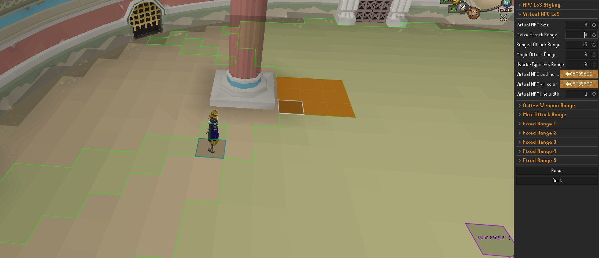
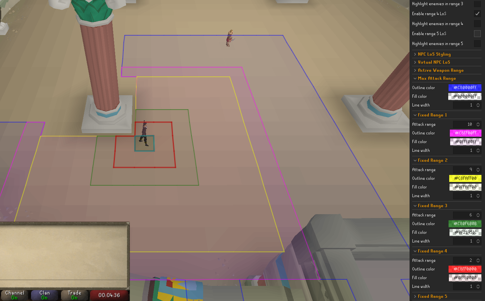
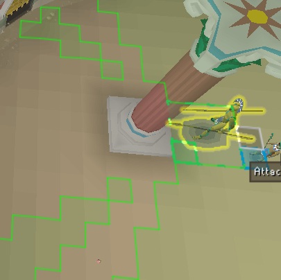
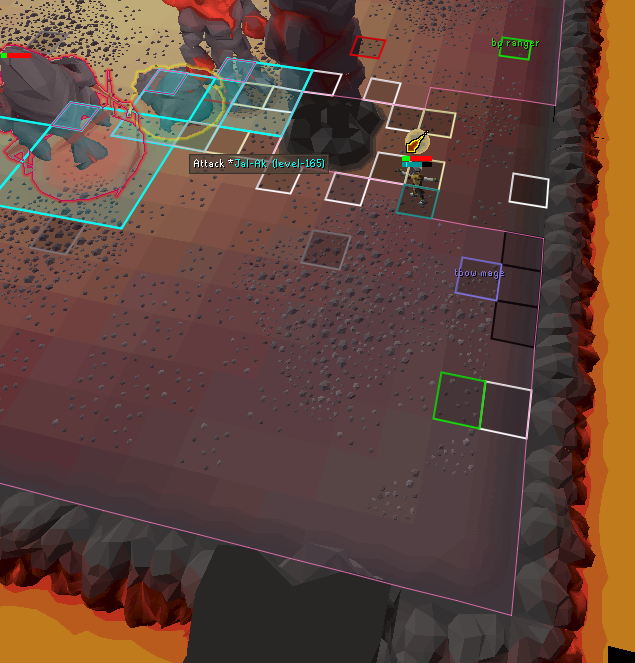
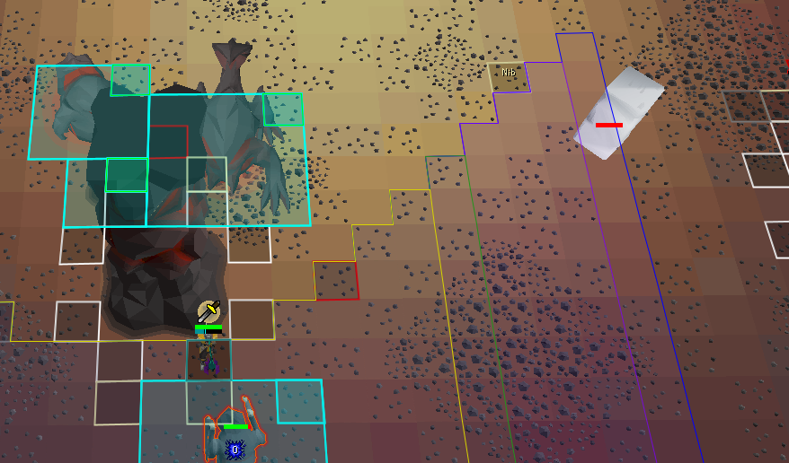
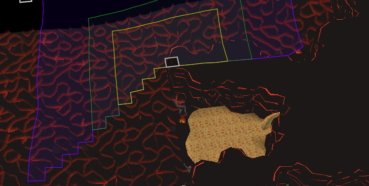
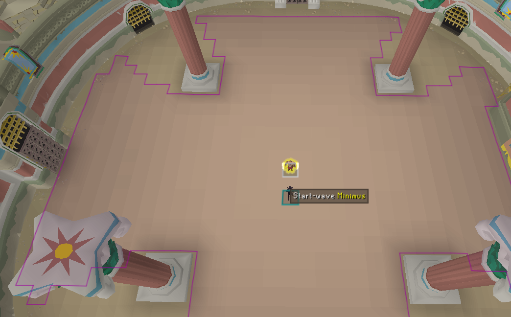

# Dynamic line of sight
## Player line of sight
The following lines of sight may be drawn around the player:
- Attack range of the current weapon and style
- Attack range of manual spell casts (attack range of 10)
- Up to 5 customizable attack ranges. E.g., can be used to pre-define various attack ranges of weapon switches.

Each line of sight can be drawn with its own outline and fill color.

During Fortis Colosseum trials, the active Myopia tier will be factored into all attack ranges with the exception of the manual spell cast.  
Furthermore, a keybind may be defined to allow the player line of sight to be toggled on/off by pressing it.

### Virtual player line of sight
If the virtual line of sight keybind is configured, the player lines of sight will be drawn as if the player is standing at the location of the cursor while the button is pressed.
 

## NPC line of sight
NPC lines of sight may also be drawn if the option is enabled and you are hovering over an NPC. 
Four different lines of sight can be configured, which by default correspond to various combat styles (melee=red, ranged=green, magic=blue and hybrid/typeless=purple). The outline/fill color of these groups can be changed, as well as the line width. 
All NPC lines of sight can be configured in the NPC LoS Definitions section. Each NPC is to be formatted as follows: `<NPC_NAME>|<ATTACK_RANGE>` OR `<NPC_ID>|<ATTACK_RANGE>`, as shown in the image below.  
 
_Example of a custom defined NPC line of sight of a corner-trapped, angry guard. The configurations are shown on the right._  
In order to make an attack range of 1 include diagonal tiles, use 1* instead of 1.  

By default, all foes encountered in the TzHaar Fight Caves, the Inferno, TzHaar-Ket-Rak's challenges and Fortis Colosseum have been defined; these definitions can be used as an example. 
Additionally, a keybind can be set to make the line of sight only appear while the keybind is pressed. If this is not defined, the lines of sight will always be drawn while hovering over configured NPCs.

### Virtual NPC line of sight
Similar to the virtual player line of sight, a virtual NPC line of sight may also be drawn. Additionally, the virtual NPC line of sight may vary in its size. While drawing, its SW tile is positioned below the cursor while the bound keybind is pressed. Its outline can also be given a custom styling. An example of this is shown below. 

 
_Example of the virtual NPC line of sight that resembles a Javelin colossus behind a pillar_  

## Examples
 
_Example of various pre-defined lines of sight, with Myopia II active_  

 
_Example of the NPC line of sight of a Javelin colossus behind a pillar_  

 
_Example in which the Jal-Ak line of sight is used to position oneself safely out of its range_  

 
_Example of how the player line of sight can be used to check if a nibbler is in range_  

 
_Example of how the virtual player Line of Sight could be used to identify corner traps at a distance_  

 
_Fictitious example of the NPC line of sight, if Minimus were to have an attack range of 15_  