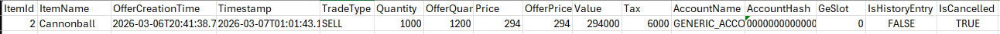

# Data Logger
Data logger that will store various types of data locally.  
Logged data is stored in directories located in the plugin root directory located at ${user.home}/.runelite/data-logger

The plugin itself does not (yet) provide means to interact with/view data, it merely logs.

## File structure
The logger plugin stores its exported data in subdirectories of the plugin root, the plugin itself also relies on internal data.

### Internal
One of the subdirectories, internal, is used by the plugin. These files are assumed to be used by the 
plugin only, modifying them or interacting with them while the plugin is used may affect plugin performance.
Most of the data in other folders can be reproduced using the internally cached data. 

### Other directories
All other directories are data dumps produced by the logger; locking the files (e.g. by opening a CSV file using excel) 
may prevent the plugin from updating it, but should not interfere with the plugin in any other way. The sections below describe 
what data is stored where.

## Item-related data loggers
These loggers have been written to accommodate using multiple clients simultaneously and minimize risk for I/O errors.
Furthermore, they are designed to keep track of items across multiple accounts.

<details>
  <summary>Grand Exchange logger</summary>

If enabled, completed Grand Exchange offers are logged upon finalizing (more specifically; as soon as the progress bar turns green or red, indicating completion or cancellation, respectively).

For each offer, the following datapoints are logged;
- ItemId: The OSRS item ID
- ItemName
- OfferCreationTime: Timestamp at which the offer was created
- Timestamp: Timestamp at which the offer was completed
- TradeType: BUY for a purchase, SELL for a sale
- Quantity: Quantity of items traded
- OfferQuantity: Quantity of items in the offer
- Price: Price per item traded
- OfferPrice: Price per item in the offer
- Value: Amount of GP transferred in the trade
- Tax: Total tax paid
- AccountName: Name of the account that placed the offer
- AccountHash: account-specific hash value (retained across name changes)
- GeSlot: Value of 0-7 that indicates the Grand Exchange slot used, or -1 for entries generated from the Grand Exchange history data only.
- IsHistoryEntry: If true, data is drawn solely from the Grand Exchange history UI
- IsCancelled: If true, the offer was cancelled prematurely


_An example entry in the CSV file produced by the Grand Exchange logger_

Grand exchange offers are stored internally in a JSON file, a copy of this JSON file will be made if its configuration is enabled.
Furthermore, offers may also be written to a CSV file. Files produced by the Grand Exchange logger are stored in the `.runelite/grand-exchange/<ACCOUNT_NAME>` directory.
CSV files are separated per day, named as `grand-exchange_YYYY-MM-DD.csv`. To facilitate using multiple clients simultaneously, the account name is used as root directory, 
effectively separating files per account.

Grand Exchange offers are designed to contain as much information as possible. This information is limited to offer metadata and its 
parameters upon completion.
Furthermore, I tried to design the exchange logger as robust as possible in order to minimize missing logged offers.


<details>
    <summary>Grand Exchange History</summary>
The Grand Exchange logger is also designed to retroactively update Grand Exchange offers that have already been
submitted, this mechanism is triggered by opening the Grand Exchange history interface. 

Certain values of previous submitted offers are overwritten by parsing the Grand Exchange history, like the tax.
This Grand Exchange history entry data tends to be more accurate, as it literally describes the amount of tax deducted / GP traded in a completed offer. 
The taxed value cannot be induced with absolute certainty for sale offers priced above 50gp using RuneLite Grand Exchange offers (i.e. whether one sells an item for 99 gp 
or 100 gp results in a 1gp and 2gp tax, respectively. Both cases would in turn result in the person selling receiving 98 
gp per item, which is the information provided by RuneLite). 
I tried to resolve this discrepancy by updating existing offers with this grand exchange history information, provided an entry can be matched to a submission.
In case no match can be made, the offer is not stored.

Ongoing offers are also tracked to determine the creation timestamp and to prevent duplicate submissions. The creation timestamp 
is logged if it is available.

All files located in the grand-exchange directory are constructed using data from the internal ge-history directory. 
These files can be reproduced manually by via the buttons in the sidebar menu. The amount of internally logged offers 
can be limited via the config menu, if need be. An undefined value means the internal offer cache may be expanded 
indefinitely.

</details>

### Sidebar buttons

<details>

    <summary>Write CSV files</summary>

Write all internal data to CSV files, grouped per day. Existing files will be overwritten.
</details>

<details>

    <summary>Write json file</summary>
Copies the internal JSON file to the grand-exchange directory. Existing file will be overwritten.

</details>


</details>


<details>

    <summary>Item vault loggers</summary>
If enabled, the contents of item vaults (e.g. banks/seed vault) and ongoing grand exchange offers are logged per account and also merged into a single, separate file.
Specific accounts may be excluded from aggregated lists via plugin configurations.
Partially completed offers are added to item vault data as;

- The unspent amount of GP for buy offers
- The quantity of items that is yet to be sold for sell offers

All tracked lists are updated whenever the associated interface is opened and closed. An exception is the combined list, 
which is generated by pressing the Export Vault Summary button in the sidebar.

The combined list is a single file that combines all vault data of all accounts into a single json/csv file. All rows can
 still be retraced after combining it, as they are tagged with an account name and a vault type (e.g. BANK).

As of now, the combined list merges banked item data, active ge offer data (the unfinished bit, to be precise) and seed vault data across all accounts.


<details>

    <summary>Example item vault data</summary>

The following data is logged as an item vault entry;

```json
  [{
    "accountHash": 1234567890123456789,
    "accountName": "ACCOUNT_NAME",
    "vaultType": "BANK",
    "itemId": 4151,
    "itemName": "Abyssal whip",
    "quantity": 1
  },
  {
    "accountHash": 1234567890123456789,
    "accountName": "ACCOUNT_NAME",
    "vaultType": "SEED_VAULT",
    "itemId": 5312,
    "itemName": "Acorn",
    "quantity": 750
  }]


```

In files used to compose aggregated lists, the accountHash and vaultType are encoded in the fileName and excluded from 
the json and csv file content. This data is added to merged data structures.

</details>


</details>

## Colosseum
Data loggers related to tracking Colosseum progress.
Generated files are bundled per attempt in a newly created directory, which is named as `<ACCOUNT_NAME>_<YYMMDD>_<HHMMSS>`,
and created in ${user.home}/.runelite/data-logger/colosseum. All tracked data that is related to an attempt is stored in 
this folder.


<details>
    <summary>Colosseum wave logger</summary>

Logger that keeps track of Colosseum data per wave. If enabled, the following datapoints are logged;
- Wave number
- Wave status [COMPLETED/FAILED/CANCELLED/CONFIG_DISABLED]
- Account name
- Tag: User-defined tag that can be set in config menu
- Wave reward(s)
  - Dizana's quiver can also be stored as 4,000 Sunfire splinters
  - Hidden next wave loot can also be logged
- Modifiers: choices and modifier chosen
- Time taken: Wave completion time in seconds
- Damage taken: Amount of damage directly taken from enemies (i.e. that counts towards damage bonus)
- Speed/damage/modifier/completion glory earned
- Wave glory: Glory earned during this wave
- Total glory: Total glory earned so far
- Mob spawn locations: X and Y coordinates for each mob, except for Sol and Fremenniks
- Manticore sequence: Orb sequences of manticores encountered during the wave (bottom-top)

The data described above is always generated as JSON file, and may additionally also be generated as CSV file.


<details>
    <summary>Colosseum json log entry</summary>

```JSON
[
  {
    "wave": 8,
    "status": "COMPLETED",
    "accountName": "ACCOUNT",
    "tag": "",
    "earnedLoot": [
        {
        "itemId": 28942,
        "itemName": "Echo crystal",
        "quantity": 3
        }
    ],
    "modifierChoices": [
        "BLASPHEMY_III",
        "MANTIMAYHEM_II",
        "MYOPIA_I"
    ],
    "chosenModifier": "MANTIMAYHEM_II",
    "startTick": 1430,
    "endTick": 1728,
    "timeTaken": 178.8,
    "speedBonus": 1616,
    "damageTaken": 0,
    "damageBonus": 800,
    "modifierGlory": 1300,
    "completionBonus": 800,
    "waveGlory": 4516,
    "totalGlory": 23590,
    "javelinColossusSpawnA": {
        "x": 40,
        "y": 35
    },
    "javelinColossusSpawnB": {
        "x": 35,
        "y": 31
    },
    "manticoreSpawnA": {
        "x": 33,
        "y": 42
    },
    "manticoreSequenceA": {
    "orbs": [
        "MAGIC",
        "RANGE",
        "MELEE"
    ]
    },
    "shockwaveColossusSpawnA": {
        "x": 44,
        "y": 37
    },
    "minotaurReinforcementsSpawn": {
        "x": 33,
        "y": 48
    }
  }
]
```
_An example entry in the Colosseum JSON log_

</details>


_Example of a partial CSV row of the Colosseum wave logger_
</details>

<details>
    <summary>Colosseum Timeline logger</summary>

If enabled, during every tick of each wave a game state is parsed and added to a timeline.
A state is composed of the following values;
- Wave number
- Timestamp (optional; unix and/or hh:mm:ss.ms)
- Tick number, relative to wave start, starting at 0
- Player X and Y coordinates
- Player HP and Prayer
- NPC list. For each relevant NPC, the following data is stored;
  - NpcId
  - Name
  - X and Y coordinate
  - HP and Max HP
  - (Manticores only) Orb sequence

    Fremenniks, Solarflares, Healing totems, Bee Swarms and Beam crystals are optional and can be disabled via configurations.
    Relevant NPCs are NPCs one has to defeat to complete the wave.
<details>
    <summary>Colosseum timeline entry</summary>

```json
[
  {
    "wave": 8,
    "timestampHms": "19:40:57.6",
    "timestampUnix": 1773168057681,
    "tick": 175,
    "playerHp": 99,
    "playerPrayer": 37,
    "playerX": 25,
    "playerY": 40,
    "npcs": [
      {
        "npcId": 12818,
        "name": "Manticore",
        "x": 27,
        "y": 40,
        "hp": 42,
        "maxHp": 250,
        "orbSequence": "MAGIC-RANGE-MELEE"
      },
      {
        "npcId": 12817,
        "name": "Javelin Colossus",
        "x": 30,
        "y": 41,
        "hp": 220,
        "maxHp": 220
      },
      {
        "npcId": 12819,
        "name": "Shockwave Colossus",
        "x": 42,
        "y": 40,
        "hp": 125,
        "maxHp": 125
      }
    ]
  }
 ]
```

_Example of state data_

</details>


</details>

<details>
  <summary>Colosseum wave completion screenshots</summary>


If enabled, a screenshot is created and stored in the directory created for that attempt when the interface between waves or the rewards chest interface pops up.

_An example of a screenshot taken after wave 12 is completed_

</details>

