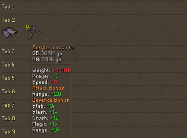

# Bank Placeholder Prices

A Plugin that adds Grand Exchange (GE) and High Alchemy (HA) price tooltips to bank placeholders.

The plugin extends the item value tooltips to placeholders and therefore it inherits those configurations.
A minor difference is that the GE and HA prices are displayed in light gray, rather than white, to indicate that the item is not owned.

## Example
> 
