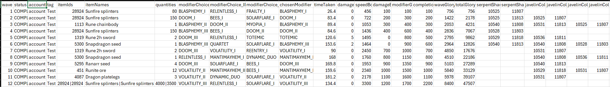
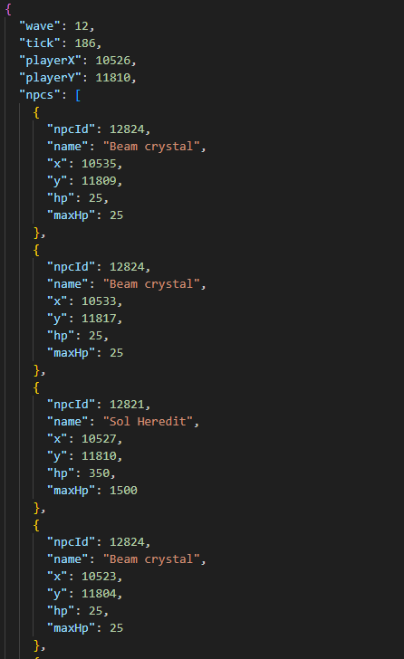
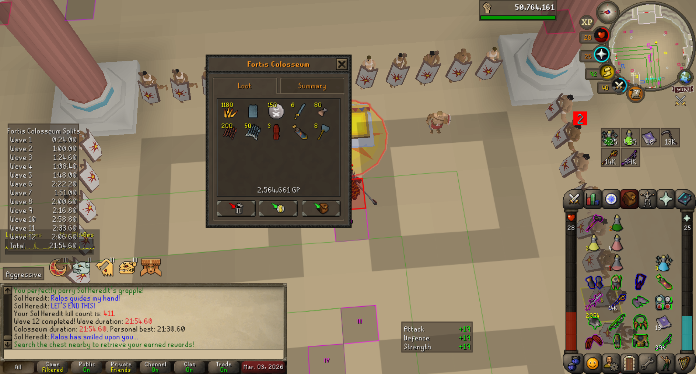

# Data Logger
Data logger that will store various types of data locally.
Logged data is stored folders located in ${user.home}/.runelite/data-logger

## Colosseum
### Colosseum trial logger
Logger that keeps track of Colosseum data per wave. If enabled, the following datapoints are logged;
- Wave number
- Wave status [COMPLETED/FAILED/CANCELLED/CONFIG_DISABLED]
- Account name
- Tag: User-defined tag that can be set in config menu
- Wave reward(s)
  - Dizana's quiver can also be stored as 4,000 Sunfire splinters
- Modifiers: choices and modifier chosen
- Time taken: Wave completion time in seconds
- Damage taken: Amount of damage directly taken from enemies (i.e. that counts towards damage bonus)
- Speed/damage/modifier/completion glory earned
- Wave glory: Glory earned during this wave
- Total glory: Total glory earned so far
- Mob spawn locations: X and Y coordinates for each mob, except for Sol and Fremenniks
- Manticore sequence: Orb sequences of manticores encountered during the wave (bottom-top)
The data described above is always generated as JSON file, but can also be generated as CSV file.
Logs are stored in the csv and log folder in ${user.home}/.runelite/data-logger/colosseum

_Example CSV row of the Colosseum wave logger, note that it does not show the entire row_

### Colosseum timeline logger
If enabled, during every tick of each wave a game state is parsed and added to a timeline.
A state is composed of the following values;
- Wave number
- Tick number, relative to wave start, starting at 0
- Player X and Y coordinates
- NPC list. For each relevant NPC, the following data is stored;
  - NpcId
  - Name
  - X and Y coordinate
  - HP and Max HP
Fremenniks, Solarflares, Healing totems, Bee Swarms and Beam crystals are optional and can be disabled via configurations.
Timelines are stored in ${user.home}/.runelite/data-logger/colosseum/timeline

_Example of state data at a particular tick during a particular wave_

### Wave completion screenshots
If enabled, a screenshot is created and stored in ${user.home}/.runelite/data-logger/screenshot/colosseum when the 
interface between waves or the rewards chest interface pops up.
For each attempt, a new directory is created and all screenshots taken during that attempt are stored in that directory.

_An example of a screenshot taken after wave 12 is completed_

## Grand Exchange Logger
If enabled, completed Grand Exchange offers are submitted upon completion. 
For each offer, the following datapoints are submitted; 
- item_id: OSRS item ID
- timestamp: Timestamp on which the offer was completed
- timestamp created: Timestamp on which the offer was created
- is buy: true if the offer was a purchase (TRUE/FALSE)
- quantity: The quantity of items that were traded
- offer quantity: The quantity on the offer
- price: The average price per traded item
- offer price: The price on the offer
- value: Total amount of GP transferred
- account name: Name of the account that submitted the exchange offer
- grand exchange slot index: Index of the Grand Exchange slot (0-7)
