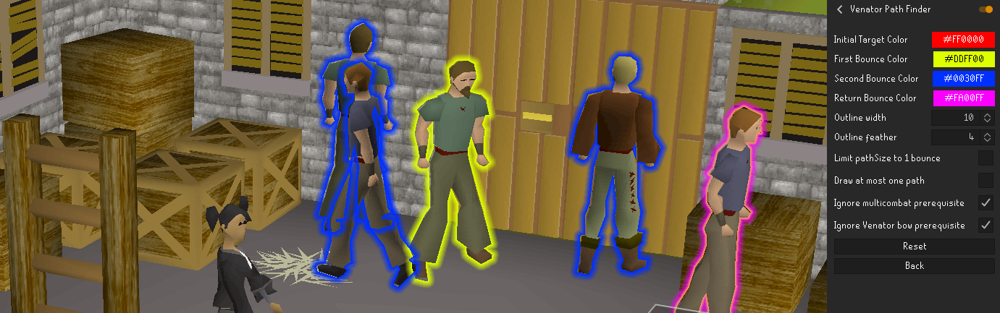
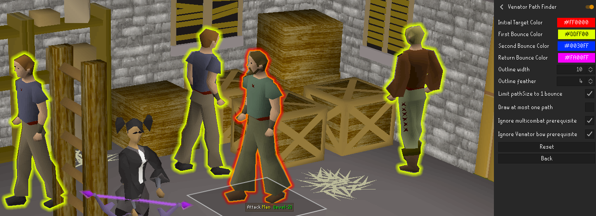
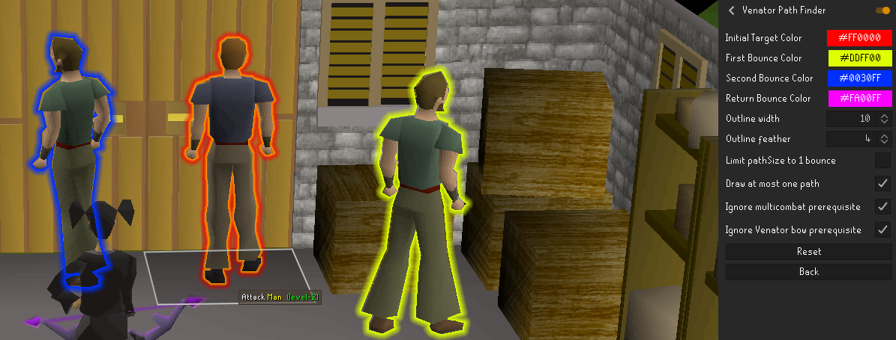

# Venator Path Finder
Plugin that will highlight NPCs that may get attacked by a bouncing Venator bow projectile aimed at the target you are hovering over.
Each bounce can be given a different color, as shown below. The path size can also be limited to one, as well as the amount of paths drawn. 
Below are various examples, on the right of each image, the applicable configurations are shown. 

 
_Various highlighted NPCs, the magenta highlighted Man is the targeted NPC, and at risk of receiving a rebound arrow_  

 
_Various highlighted NPCs, the red highlighted Man is the targeted NPC. Path size is limited to 1 bounce._  

 
_Three highlighted NPCs, with up to one path highlighted._