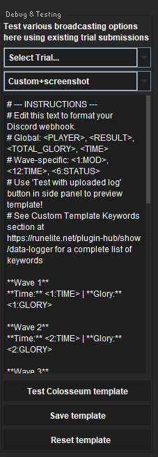

# Data Logger
Data logger that will store completed Grand exchange offers, item data and Colosseum trials locally.  
Logged data is stored in directories located in the plugin root directory located at `${user.home}/.runelite/data-logger`</br>
Additionally, Colosseum trials may also be submitted to Discord channels by configuring a webhook URL.

Logged item data and Colosseum trials may also be viewed via the sidepanel, which can be used to view both individual datapoints, as well as aggregated stats based on these datapoints.

## File structure

<details>
  <summary>Click to expand</summary>

The logger plugin stores its exported data in subdirectories of the plugin root, the plugin itself relies primarily on internal data.

### Internal
One of the subdirectories, internal, is used by the plugin. These files are assumed to be used by the
plugin only, modifying them or interacting with them while the plugin is used may negatively affect plugin performance.
Most of the data in other folders can be reproduced using the internally cached data.

### Other directories
All other directories are data dumps produced by the logger; locking the files (e.g. by opening a CSV file using excel)
may prevent the plugin from updating it, but should not interfere with the plugin in any other way. The sections below describe
what data is stored where.

</details>

## Item data loggers
These loggers have been written to accommodate using multiple clients simultaneously and minimize risk for I/O errors.
Furthermore, they are designed to keep track of items across multiple accounts.

### Grand Exchange logger

<details>

  <summary>Click to expand</summary>

If enabled, completed Grand Exchange offers are logged upon the moment they are completed and while collecting the offers. For each completed exchange offer, the following datapoints are logged;

- ItemId: The OSRS item ID
- ItemName: Name of the item
- isBuy: true for a purchase, false for a sale
- Quantity: Quantity of items traded
- Price: Price per item traded
- Value: Amount of GP transferred in the trade
- Tax: Tax paid per item
- AccountName: Name of the account that placed the offer
- AccountHash: account-specific hash value (retained across name changes)
- GeSlot: Value of 0-7 that indicates the Grand Exchange slot used
- IsCancelled: If true, the offer was cancelled prematurely
- OfferCreationTime: Timestamp at which the offer was created
- ExactTimestamp: Timestamp at which the offer was logged
- OriginalOfferQuantity: Quantity of items in the offer
- OriginalOfferPrice: Price per item in the offer

```json
{
  "itemId": 6018,
  "itemName": "Poison ivy berries",
  "isBuy": false,
  "quantity": 73,
  "price": 500,
  "value": 36500,
  "tax": 10,
  "accountName": "ACCOUNT_NAME",
  "accountHash": 1111111111111111111,
  "geSlot": 6,
  "isCancelled": true,
  "offerCreationTime": 1777777777776,
  "exactTimestamp":1777777777778,
  "originalOfferQuantity": 9500,
  "originalOfferPrice": 400
}
```
_An example entry of a completed Grand Exchange offer submitted to a JSON file_

Grand exchange offers are stored internally in a JSONL file. After this file is updated, JSON/CSV files are written/appended as well, depending on configurations.
The naming format can also be configured and this may bundle completed offer per day/week/month. Files produced by the Grand Exchange logger are stored in the `.runelite/grand-exchange/completed/<ACCOUNT_NAME>` directory.


#### Grand Exchange History

The Grand Exchange history UI is parsed whenever it is opened. Its entries are exported to `.runelite/grand-exchange/history/<ACCOUNT_NAME>`. Though the history entries are less informative, they may still catch offers that have been missed for whatever reason and the tax value tends to be more precise. History entries are only logged after opening the UI. They are also checked for duplicates in the 40 most recent submissions.
History entries are tracked separately from regular completed exchange offers.


</details>

### Item logger
<details>
    <summary>Click to expand</summary>

If enabled, item data (e.g. bank/seed vault/STASH units) is logged per account and stored locally into separate files per account per source.
In case of item charges, the items logged are the items you would retrieve if you were to uncharge the item.

<details>
    <summary>Item sources</summary>
For each account, the following item data is tracked;
General Vaults & Storages

    Bank  

    Seed vault  

    Items in inventory and worn equipment

    Ongoing Grand Exchange offers

    POH costume room  

    Vyre well  

    Tombs of Amascut pickaxe  

    Rune pouch  

    Bolt pouch  

    Dizana's quiver  

    Master scroll book  

    Tool leprechaun (Farming tools)  

    STASH units  

Coffers

    Blast furnace coffer

    Nightmare Zone coffer

    LMS coffer

    Kingdom of Miscellania coffer  

Charged Weapons & Equipment

    Melee: Scythe of Vitur, Viggora's chainmace, Ursine chainmace  

    Ranged: Toxic blowpipe, Venator bow, Tonalztics of Ralos, Craw's bow, Webweaver bow  

    Magic: Tumeken's shadow, Eye of Ayak, Sanguinesti staff, Toxic trident (including Enhanced), Trident of the seas (including Enhanced), Warped sceptre, Thammaron's sceptre, Accursed sceptre  

    Elemental tomes: Tome of fire, Tome of earth, Tome of water

</details>

Specific accounts may be excluded from aggregated lists via plugin configurations.
Partially completed offers are logged as;

- The unspent amount of GP for buy offers
- The quantity of items that is yet to be sold for sell offers

All tracked lists are updated whenever possible, albeit at a moderate frequency. For this reason, item charges only update following item charge related chat messages.

All item data across all accounts may be combined into a single json/csv file. All rows can
 still be retraced after combining it, as they are tagged with an account name and a vault type (e.g. BANK).</br> 
Each row of the combined list has the following attributes;
- accountName
- accountHash
- source
- itemId
- itemName
- quantity

Additionally, there is also a merged list that merges all item stacks found in the combined list and values them.</br> 
Each row of the merged list has the following attributes;
- itemId
- itemName
- quantity (merged quantity across all sources)
- value (of the merged quantity)

#### Examples of item data

</br>
_Example of an excerpt from a combined item csv file_<br><br>


The following data is logged as an item vault entry;

```json
  [{
    "accountHash": 1234567890123456789,
    "accountName": "ACCOUNT_NAME",
    "vaultType": "BANK",
    "itemId": 4151,
    "itemName": "Abyssal whip",
    "quantity": 1
  },
  {
    "accountHash": 1234567890123456789,
    "accountName": "ACCOUNT_NAME",
    "vaultType": "SEED_VAULT",
    "itemId": 5312,
    "itemName": "Acorn",
    "quantity": 750
  }]


```

In files used to compose aggregated lists, the accountHash and vaultType are encoded in the fileName and excluded from 
the json and csv file content. This data is added to merged data structures.


</details>

## Colosseum
Data loggers related to tracking Colosseum progress.
Generated files are bundled per trial in a newly created directory, which is named as `<ACCOUNT_NAME>_<YYMMDD>_<HHMMSS>`,
and created in `${user.home}/.runelite/data-logger/colosseum/trials`. All tracked data that is related to a trial is stored in 
this folder.

Note that it is possible to set a tag in the configurations, which will allow you to group trials in the data viewer.


### Colosseum wave logger
<details>
    <summary>Click to expand</summary>

Overall Run Summary

At the root level, the log captures the final metrics and economics of the entire trial:

    Attempt ID & Timestamp: Unique identifier (Account + Date/Time) and exact Unix timestamp.

    Account Name & Final Result: The player's name and the outcome of the run (COMPLETED, FAILED, or CLAIMED).

    Total Run Metrics: Final cumulative time taken (in seconds) and total Glory earned.

    Final Modifiers: A complete list of all modifiers active at the end of the run.

    Rewards Breakdown: 
        Total Grand Exchange value of all earned loot.

        Breakdown of all rewards as item, quantity and value

    Supply Cost Breakdown: 
        Total Grand Exchange value of all supplies consumed during the trial.

        Items/Runes: Tracked by quantity and GE value (e.g., Blood runes, Dragon arrows).

        Potions: Tracked by individual doses consumed and their fractional GE value (e.g., Super restores, Saradomin brews).

        Weapon Charges: Tracked by charges consumed and their GE value equivalent (e.g., Scythe of Vitur, Tumeken's Shadow, Venator bow).

Wave-by-Wave Data (waves array)

For granular analysis, every individual wave logs the following data points:

    Wave Number & Status: The current wave and its specific completion status (COMPLETED, FAILED, or CANCELLED)

    Tag: A custom, user-defined tag that can be set in the config menu.

    AccountName & GameMode: Name of the account completing the trial and the GameMode of the world it was completed in (e.g. Leagues) 

    Wave Reward: The specific loot earned for completing this wave (Item ID, Name, and Quantity) and its value. Note: This only includes the random roll, not the Quiver reward.

    Modifiers: 

        The 3 modifier choices offered at the start of the wave.

        The specific modifier chosen.

        The cumulative modifiers active during this specific wave.

    Time Metrics: Wave completion time in seconds, alongside the cumulative time taken so far.

    Glory & Performance Metrics: * Damage taken: Amount of damage directly taken from enemies (i.e., damage that negatively impacts the damage bonus).

        Glory breakdown: Speed bonus, Damage bonus, Modifier glory, and Completion bonus.

        Totals: Total glory earned this wave, and cumulative glory earned so far.

    Mob Spawns & Mechanics:

        Spawn Locations: Exact X and Y coordinates for initial mob spawns (e.g., Javelin/Shockwave Colossi) and mid-wave reinforcements (e.g., Minotaurs, Serpent Shamans). Note: Excludes Sol Heredit and Fremennik warbands.

        Manticore Sequences: The specific attack orb sequences (Magic/Range/Melee) of manticores encountered during the wave, tracked individually if multiple spawn.

The data described above may be generated as JSON file and as CSV file. The latter will produce multiple CSV files.


<details>
    <summary>Colosseum json log entry</summary>

```JSON
{
  "attemptId": "ACCOUNT_NAME_260501_111111",
  "timestamp": 1777777777777,
  "accountName": "ACCOUNT_NAME",
  "result": "COMPLETED",
  "rewardsValue": 3961576,
  "gameMode": "REGULAR",
  "rewards": {
    "Dragon platelegs": {
      "count": 4,
      "totalValueInGp": 644824
    },
    "Death rune": {
      "count": 600,
      "totalValueInGp": 112200
    },
    "Sunfire splinters": {
      "count": 5330,
      "totalValueInGp": 2137330
    },
    "Dragon arrowtips": {
      "count": 250,
      "totalValueInGp": 719250
    },
    "Onyx bolts": {
      "count": 30,
      "totalValueInGp": 248700
    },
    "Snapdragon seed": {
      "count": 1,
      "totalValueInGp": 60714
    },
    "Rune platebody": {
      "count": 1,
      "totalValueInGp": 38558
    }
  },
  "consumedSupplyValue": 452114,
  "consumedSupplies": {
    "totalValue": 452114,
    "consumedItems": {
      "Death rune": {
        "count": 14,
        "totalValueInGp": 2618
      },
      "Blood rune": {
        "count": 69,
        "totalValueInGp": 20562
      },
      "Dragon arrow": {
        "count": 46,
        "totalValueInGp": 131974
      },
      "Aether rune": {
        "count": 25,
        "totalValueInGp": 20250
      },
      "Fire rune": {
        "count": 110,
        "totalValueInGp": 440
      },
      "Black chinchompa": {
        "count": 6,
        "totalValueInGp": 18960
      }
    },
    "consumedDoses": {
      "Divine ranging potion": {
        "count": 5,
        "totalValueInGp": 8330
      },
      "Divine super combat potion": {
        "count": 6,
        "totalValueInGp": 28434
      },
      "Sanfew serum": {
        "count": 26,
        "totalValueInGp": 121108
      }
    },
    "consumedCharges": {
      "Scythe of vitur": {
        "count": 123,
        "totalValueInGp": 83394
      },
      "Venator bow": {
        "count": 57,
        "totalValueInGp": 912
      },
      "Tumekens shadow": {
        "count": 12,
        "totalValueInGp": 15132
      }
    }
  },
  "totalGlory": 51448,
  "totalTime": 1439.4,
  "activeModifiers": [
    "FRAILTY_III",
    "DOOM_III",
    "TOTEMIC",
    "SOLARFLARE_III",
    "MYOPIA_I",
    "VOLATILITY_I"
  ],
  "waves": [
    {
      "wave": 1,
      "status": "COMPLETED",
      "accountName": "ACCOUNT_NAME",
      "tag": "",
      "earnedLoot": {
        "itemId": 28924,
        "itemName": "Sunfire splinters",
        "quantity": 80
      },
      "lootValue": 32400,
      "gameMode": "REGULAR",
      "modifierChoices": [
        "BLASPHEMY_I",
        "RELENTLESS_I",
        "FRAILTY_I"
      ],
      "chosenModifier": "FRAILTY_I",
      "activeModifiers": [
        "BLASPHEMY_I",
        "RELENTLESS_I",
        "FRAILTY_I"
      ],
      "timeTaken": 21.6,
      "speedBonus": 464,
      "damageTaken": 0,
      "damageBonus": 100,
      "modifierGlory": 200,
      "completionBonus": 100,
      "waveGlory": 864,
      "totalGlory": 864,
      "totalTimeTaken": 21.6,
      "serpentShamanSpawnX": 35,
      "serpentShamanSpawnY": 37,
      "version": 1
    },
    {
      "wave": 11,
      "status": "COMPLETED",
      "accountName": "ACCOUNT_NAME",
      "tag": "",
      "earnedLoot": {
        "itemId": 560,
        "itemName": "Death rune",
        "quantity": 300
      },
      "lootValue": 56100,
      "gameMode": "REGULAR",
      "modifierChoices": [
        "SOLARFLARE_III",
        "MYOPIA_II",
        "RELENTLESS_I"
      ],
      "chosenModifier": "SOLARFLARE_III",
      "activeModifiers": [
        "BLASPHEMY_I",
        "RELENTLESS_I",
        "FRAILTY_III",
        "DOOM_III",
        "TOTEMIC",
        "SOLARFLARE_III",
        "MYOPIA_I"
      ],
      "timeTaken": 157.8,
      "speedBonus": 2607,
      "damageTaken": 0,
      "damageBonus": 1100,
      "modifierGlory": 2350,
      "completionBonus": 1100,
      "waveGlory": 7157,
      "totalGlory": 42154,
      "totalTimeTaken": 1311.6,
      "javelinColossusSpawnAX": 44,
      "javelinColossusSpawnAY": 32,
      "manticoreSpawnAX": 44,
      "manticoreSpawnAY": 37,
      "manticoreSequenceA": [
        "RANGE",
        "MAGIC",
        "MELEE"
      ],
      "manticoreSpawnBX": 35,
      "manticoreSpawnBY": 31,
      "manticoreSequenceB": [
        "MAGIC",
        "RANGE",
        "MELEE"
      ],
      "shockwaveColossusSpawnAX": 29,
      "shockwaveColossusSpawnAY": 37,
      "serpentShamanReinforcementsSpawnX": 31,
      "serpentShamanReinforcementsSpawnY": 48,
      "minotaurReinforcementsSpawnX": 33,
      "minotaurReinforcementsSpawnY": 48,
      "version": 1
    },
    {
      "wave": 12,
      "status": "COMPLETED",
      "accountName": "ACCOUNT_NAME",
      "tag": "",
      "earnedLoot": {
        "itemId": 11237,
        "itemName": "Dragon arrowtips",
        "quantity": 250
      },
      "lootValue": 719250,
      "gameMode": "REGULAR",
      "modifierChoices": [
        "VOLATILITY_I",
        "BEES_I",
        "QUARTET"
      ],
      "chosenModifier": "VOLATILITY_I",
      "activeModifiers": [
        "BLASPHEMY_I",
        "RELENTLESS_I",
        "FRAILTY_III",
        "DOOM_III",
        "TOTEMIC",
        "SOLARFLARE_III",
        "MYOPIA_I",
        "VOLATILITY_I"
      ],
      "timeTaken": 127.8,
      "speedBonus": 3444,
      "damageTaken": 0,
      "damageBonus": 1200,
      "modifierGlory": 2450,
      "completionBonus": 2200,
      "waveGlory": 9294,
      "totalGlory": 51448,
      "totalTimeTaken": 1439.4,
      "version": 1
    }
  ],
  "version": 1
}
```
_An example entry in the Colosseum JSON log. The waves list only shows wave 11 as an example._

</details>


<br>
_Example of a partial CSV row of the Colosseum wave logger_<br><br>
</details>


### Colosseum timeline logger
<details>
    <summary>Click to expand</summary>

If enabled, during every tick of each wave a game state is parsed and added to a timeline.
A state is composed of the following values;
- Wave number
- Timestamp (optional; unix and/or hh:mm:ss.ms)
- Tick number, relative to wave start, starting at 0
- Player X and Y coordinates
- Player HP and Prayer
- NPC list. For each relevant NPC*, the following data is stored;
  - NpcId
  - Name
  - X and Y coordinate
  - HP and Max HP
  - (Manticores only) Orb sequence

    Fremenniks, Solarflares, Healing totems, Bee Swarms and Beam crystals are optional and can be disabled via configurations.</br>
    \* Relevant NPCs are NPCs one has to defeat to complete the wave. Fremenniks are excluded by default, but may be enabled.

<details>
    <summary>Example timeline entry</summary>

```json
[
  {
    "wave": 8,
    "timestampHms": "19:40:57.6",
    "timestampUnix": 1773168057681,
    "tick": 175,
    "playerHp": 99,
    "playerPrayer": 37,
    "playerX": 25,
    "playerY": 40,
    "npcs": [
      {
        "npcId": 12818,
        "name": "Manticore",
        "x": 27,
        "y": 40,
        "hp": 42,
        "maxHp": 250,
        "orbSequence": "MAGIC-RANGE-MELEE"
      },
      {
        "npcId": 12817,
        "name": "Javelin Colossus",
        "x": 30,
        "y": 41,
        "hp": 220,
        "maxHp": 220
      },
      {
        "npcId": 12819,
        "name": "Shockwave Colossus",
        "x": 42,
        "y": 40,
        "hp": 125,
        "maxHp": 125
      }
    ]
  }
 ]
```

_Example of state data_

</details>


</details>


### Colosseum screenshots

<details>
  <summary>Click to expand</summary>


If enabled, a screenshot is created and stored in the directory created for that trial when the interface between waves or the rewards chest interface pops up.
<br>
_An example of a screenshot taken after wave 12 is completed_<br><br>

</details>

### Supply tracking

<details>
  <summary>Click to expand</summary>


If enabled, supplies are also tracked during colosseum trials. A snapshot is created at the start of a trial, and 
the supplies at the end are subtracted from the initial snapshot and stored into a file.
These supplies also include an estimate of certain item charges, like Scythe of vitur or Venator bow charges. </br>Additionally, all supplies are valued according to current market prices, this value is added to each supply count.  
Supply logs are saved as `<ACCOUNT_NAME>_<YYMMDD>_<HHMMSS>_supply-log.<EXTENSION>` in the directory created for the particular trial.

<details>

<summary>Example supply log</summary>

```json
{
  "id": "...",
  "totalValue": 422856,
  "consumedItems": {
    "Death rune": {
      "count": 11,
      "totalValueInGp": 2002
    },
    "Blood rune": {
      "count": 72,
      "totalValueInGp": 19440
    },
    "Dragon arrow": {
      "count": 42,
      "totalValueInGp": 133182
    },
    "Aether rune": {
      "count": 23,
      "totalValueInGp": 17595
    },
    "Fire rune": {
      "count": 132,
      "totalValueInGp": 660
    },
    "Black chinchompa": {
      "count": 7,
      "totalValueInGp": 19271
    }
  },
  "consumedDoses": {
    "Super restore": {
      "count": 16,
      "totalValueInGp": 42192
    },
    "Divine ranging potion": {
      "count": 5,
      "totalValueInGp": 8320
    },
    "Saradomin brew": {
      "count": 3,
      "totalValueInGp": 6165
    },
    "Divine super combat potion": {
      "count": 6,
      "totalValueInGp": 29328
    },
    "Sanfew serum": {
      "count": 10,
      "totalValueInGp": 54880
    }
  },
  "consumedCharges": {
    "Scythe of vitur": {
      "count": 115,
      "totalValueInGp": 74290
    },
    "Venator bow": {
      "count": 37,
      "totalValueInGp": 703
    },
    "Tumekens shadow": {
      "count": 11,
      "totalValueInGp": 14828
    }
  }
}
```

</details>

</details>

### Discord webhook
<details> 
    <summary>Click to expand</summary>


Trials can also be broadcast to a Discord server by configuring a webhook url in the plugin configurations.
Upon ending a trial, the results will be formatted and sent with a payload to the url. The results can be formatted in various ways; by using a pre-defined template or by using a custom template.</br>
Additionally, one can also opt to attach an image to the message sent. 

<details>
    <summary>Pre-defined broadcasting templates</summary>

The plugin has two built-in templates for broadcasting colosseum trials; concise and detailed. The former shows a brief 
summary, whereas the latter adds wave-specific information for all waves to that summary. The desired template can be selected via the dropdown menu in the plugin settings.

It is possible to omit certain properties by toggling the respective checkbox in the Discord pre-defined template section.

</br>
_An example Discord message broadcast following an unfortunately failed trial with an image attached to it using the detailed template_</br></br>


</br>
_An example Discord message broadcast following the same unfortunately failed trial using the concise template_</br></br>


</details>


<details>
    <summary>Custom broadcasting templates</summary>

The Data Logger allows one to fully customize how your trials are formatted look by selecting the CUSTOM format option in the plugin settings. You can use special keywords in the "Custom Webhook Template" text box to inject your trial data exactly how you want it.

Lines starting with # are treated as comments and will not be sent to Discord. A small example is provided as default value, which can also be restored by resetting the config to its default value.

You can completely customize the Discord webhook messages sent by the Data Logger plugin by using a custom template. The plugin will parse your template and replace the keywords below with the actual data from your Colosseum trial.

It is also possible to test a defined template using the "Test with Uploaded Log" button in the side panel, which generates a discord message using the wave-log passed. 

Note: Any line in your template starting with # will be ignored, allowing you to leave comments or notes in your configuration.

Furthermore, `MOD(S)` and `MODIFIER(S)` tend to be interchangeable; the former produces a shortened version of the modifier name, whereas the latter produces the full name.


##### Global Attempt Keywords

These keywords represent the overall stats of the entire Colosseum run.
Keyword	Description	Example Output</br>
`<PLAYER>`	The in-game name of the account.	ACCOUNT_NAME</br>
`<RESULT>`	The final outcome of the attempt.	COMPLETED, FAILED, CLAIMED</br>
`<WAVES>`	The total number of waves completed.	12</br>
`<TIME>`	The total time of the run, formatted as MM:SS.S	24:00.6</br>
`<SECONDS>`	The total time of the run in seconds.	1788.0</br>
`<GLORY>`	The total glory accumulated (comma formatted).	40,981</br>
`<VALUE>`	The total GE value of the earned rewards (comma formatted).	3,817,566</br>
`<COST>`	The total GE value of the supplies consumed (comma formatted).	475,723</br>
`<MODIFIERS>`	A comma-separated list of all active modifiers at the end of the run (full names).	BLASPHEMY_III MYOPIA_II</br>
`<MODS>`	A comma-separated list of all active modifiers at the end of the run (shortened aliases).	BL3 MY2</br>


##### Wave-specific keywords

You can pull data from a specific wave by using the syntax `<WaveNumber:PROPERTY>`.
For example, to get the loot from wave 12, you would use <12:LOOT>. If a wave was not reached, it will output N/A.</br>

Loot & Rewards

    <#:LOOT> - The quantity and name of the item earned (e.g., 80x Sunfire splinters)

    <#:LOOTNAME> - Only the name of the item earned (e.g., Sunfire splinters)

    <#:LOOTAMOUNT> - Only the quantity of the item earned (e.g., 80)

    <#:GLORY> - The glory earned during this wave.

    <#:TOTALGLORY> - The cumulative glory accumulated up to and including this wave.

Modifiers

    <#:MODIFIER> or <#:CHOSENMODIFIER> - The full name of the modifier chosen for this wave.

    <#:MOD> or <#:CHOSENMOD> - The shortened alias of the modifier chosen for this wave.

    <#:MODIFIERCHOICES> - The 3 modifiers offered during this wave (full names).

    <#:MODCHOICES> - The 3 modifiers offered during this wave (shortened aliases).

    <#:SELECTEDMODIFIERCHOICES> - The 3 modifiers offered, highlighting the chosen modifier with square brackets (full names).

    <#:SELECTEDMODCHOICES> - The 3 modifiers offered, highlighting the chosen modifier with square brackets (shortened aliases).

Combat & Stats

    <#:TIME> - The time it took to complete the wave, formatted as MM:SS.

    <#:SECONDS> - The time it took to complete the wave in seconds (e.g., 132.6).

    <#:DAMAGETAKEN> - The amount of damage taken from NPCs during this wave (only damage that counts towards the damage bonus)

    <#:STATUS> - The completion status of the wave (e.g., COMPLETED, FAILED).


</details>

<details>

<summary>Example custom template</summary>

This is an example of a template string, followed by an image of the message sent to the discord channel that uses the template. For more accepted keywords, see `Custom broadcasting templates` 
```
**Wave 1**
**Time:** <1:TIME> | **Glory:** <1:GLORY> 	  

**Wave 2**
**Time:** <2:TIME> | **Glory:** <2:GLORY>

**Wave 3**
**Time:** <3:TIME> | **Glory:** <3:GLORY>

**Wave 4**
**Time:** <4:TIME> | **Glory:** <4:GLORY>

**Wave 5**
**Time:** <5:TIME> | **Glory:** <5:GLORY>

**Wave 6**
**Time:** <6:TIME> | **Glory:** <6:GLORY>

**Wave 7**
**Time:** <7:TIME> | **Glory:** <7:GLORY>

**Wave 8**
**Time:** <8:TIME> | **Glory:** <8:GLORY>

**Wave 9**
**Time:** <9:TIME> | **Glory:** <9:GLORY>

**Wave 10**
**Time:** <10:TIME> | **Glory:** <10:GLORY>

**Wave 11**
**Time:** <11:TIME> | **Glory:** <11:GLORY>

**Wave 12**
**Time:** <12:TIME> | **Glory:** <12:GLORY>
```

</br>
_An example Discord message broadcast following the same unfortunately failed trial using the custom template above_</br></br>


</details>

</details>

## Sidebar panel
The sidebar panel is filled with various utilities. At the top is a dropdown menu that can be used to navigate to the sections described below.<br>
Most of the components in the sidebar panel have tooltips that display helpful/additional information related to the component you are hovering over.

### Colosseum statistics

<details>
<summary>Click to expand</summary>

The Colosseum statistics panel is a data viewer that allows you to browse through logged trials and waves. 


</br>
_The four table modes that can be selected in the data viewer._<br><br>

Filters can be applied based on waves that are to be included, modifiers that should (not) be active or the final result of the trial. For example, the Waves panel in the image above shows results for wave 11 and 12 in which any tier of Bees! was active.  

If you have set a tag in the configurations, you can also include or exclude trials based on these tags for that particular trial.

At the top of the panel, aggregated stats are listed for the filtered subset of data. Hovering over the cards will display additional information via a tooltip. For instance, if you filter on failed trials with the rewards table shown, it will display the total value of GP that you unfortunately missed out on if you hover over the average value/trial card.


</br>
_The aggregated stats and filter section in the Colosseum statistics panel_<br><br>

<br>
_The tooltip that appears when hovering over the Avg Value/trial card, showing the total amount of GP I unfortunately missed out on_<br><br>

</details>


### Items manager

<details>
<summary>Click to expand</summary>

The Items manager UI can be used to delete internal item data that was generated by the plugin.
It can be used to sync item data because you no longer possess the weapon, for instance.
When selecting an account and a specific item container, it will display the items that are currently stored in that file.
The buttons can be used to clear all data related to that account, or just the specific selected container.

Data deletion only affects data that was generated by the plugin and that resides inside the internal folder of the plugin.

</br>
_The items manager UI_<br><br>

</details>


### Item viewer

<details>
<summary>Click to expand</summary>

Panel with (aggregated) item data. It has filter panels that can be used to filter by account, source and item name. 
The aggregated stats describe the filtered subset of items that are shown in the table at the bottom of the items panel.


</details>


### Utilities

<details>
<summary>Click to expand</summary>

#### Directories

Panel with various buttons that navigate to the directories with the data dumps


#### Manual exports

The manual exports panel contains various buttons that may be used to manually start export operations that may involve parsing many (large) files and/or writing large files. The export operations typically involve combining a number of data structures.


#### Debug & Testing

The debug panel contains various buttons with actions that invoke actions to test configurations. It may be used to generate a Discord broadcast of a selected wave log, for instance.

</details>


### Discord webhook test panel

<details>
<summary>Click to expand</summary>


<br>
This panel may be used to select a trial, a broadcasting method and a panel to define the template text.
The keywords that may be used in the custom template are outlined in the `Discord webhook` section.

At the bottom of the panel there are three buttons;
- `Test Colosseum template`: used to submit a trial to the configured webhook url using the selected trial, broadcasting method and (if applicable) custom template.
- `Save template`: used to save the template to the plugin configurations.
- `Reset template`: used to restore the template in the textfield to the currently configured template.

</details>