# Slayer task specific bank tabs
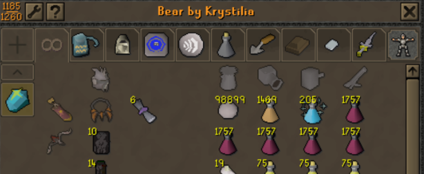</br>
Quality-of-life plugin that adds a special Slayer tab to the bank. The contents of the Slayer tab are customizable on a per-task basis. The tab effectively is a collection of dozens of separate bank tabs, but can be used as a single, unified tab.
Each combination of account, slayer master, task and (if applicable) area can be given its own optimized layout. This specific layout is shown automatically once the task is assigned by a slayer master.</br></br>
The Slayer bank tab plugin helps to tailor a specific bank tab to each task so you no longer have to recall and search for niche items like bonecrusher/antidote/antifires, only to realize you forgot another item after you arrive.


## Setting a Slayer tab
A new or existing tag tab is to be set as Slayer tab, which will alter its behaviour when opened. This can be done by right-clicking a tag tab and selecting `Set as Slayer tab`.
The plugin will be managing this particular tab, so it is recommended to use an unused tag tab.

### Configurations
Before adding layouts, check out the General section of the plugin configurations. 
`Merge Turael task tabs` and `Merge non-wildy/Konar setups` affect tab management of the plugin. Changing these configurations later may cause some layouts to become inaccessible.

- `Add inventory icon menu option`: If set, shift+right-clicking the inventory icon will also include an option that will save the current inventory and equipment worn as layout for the active task

- `Merge Turael task tabs`: To accommodate turael skipping, a configuration flag can be set that will effectively cause all tasks assigned by Turael (or Aya) to be associated with same layout.

- `Merge non-Wildy/Konar layouts`: By default, all 'regular' slayer masters are merged into the same category. If you wish to configure a specific setup per slayer master instead, you should uncheck this option.
A specific slayer master will then be assigned to a layout, rather than the merged group.

- `Auto-assign undefined layouts`: If set, a snapshot of the inventory+equipment worn is cached when closing the bank and you currently have a task without a layout assigned to it. Once the first KC for this task is made, the cached layout is automatically saved

- `Notify on layout cache`: If `Auto-assign undefined layouts` is set and this option is enabled, a game message is sent whenever the layout is cached for an undefined setup, as to remind you that the layout will be saved automatically. To prevent spam, up to one message is sent every 30 seconds.

- `'Add item to tab' menu option`: If enabled, a menu option is added to items in the bank that may be used to add the item to the currently active slayer tab

## Examples

### Configuring a single task layout

#### Setting up a Slayer tab for the currently active task

<details>
<summary> 
Click to expand 
</summary>


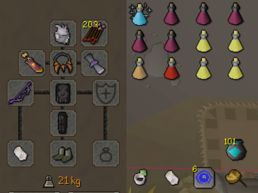</br>
_Step 1: Prepare your equipment and inventory for the task as you normally would when completing the task._

_Step 2: Open the designated Slayer tab in the bank._

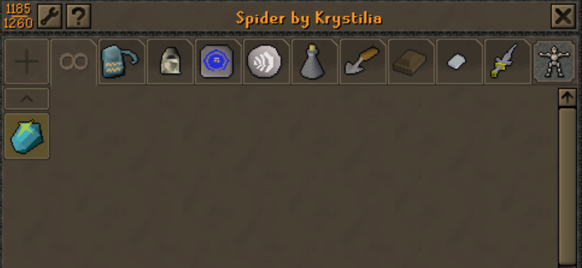</br>
_Step 3: Verify that the header displays your currently active task. If this is not the case, right click the Slayer tab and select `Reload active task`. <br>
If no setup exists, the tab should be empty._

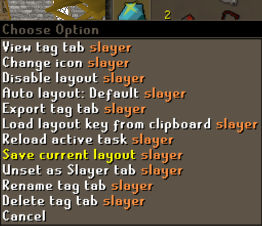</br>
_Step 4: Right click the Slayer tab, then select `Save current layout` to fill the tab with the items you prepared._

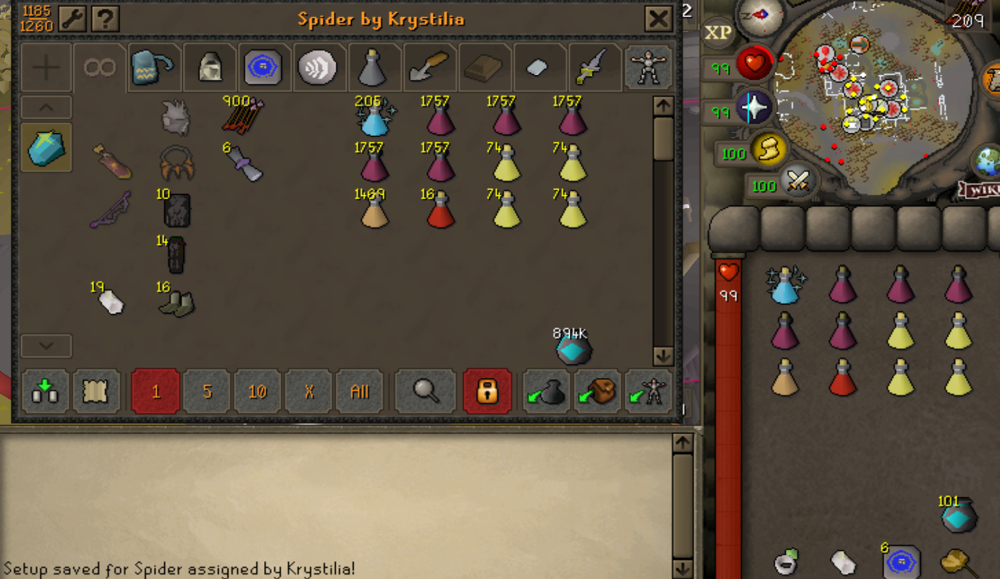</br>
_The prepared setup from step 1 should now be loaded into the Slayer tab. The first 7 rows should match your equipment worn and inventory._

</details>


#### Setting up a Slayer tab for an unassigned task

<details>
<summary> 
Click to expand 
</summary>


</br>
_Step 1: Prepare your equipment and inventory for the task as you would when completing the task._

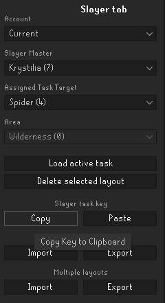</br>

_Step 2: Open the sidebar panel and specify a task using the comboboxes, then click `Copy` in the `Slayer task key` section. The key should now be loaded into your clipboard._
- _Account should match your account for the correct tab to load automatically_
- _If all slayer masters have been merged, Slayer masters other than Konar quo Maten, Krystilia and Turael share the same Slayer Master value_
- _The Area combobox is only relevant for most tasks assigned by Konar quo Maten._

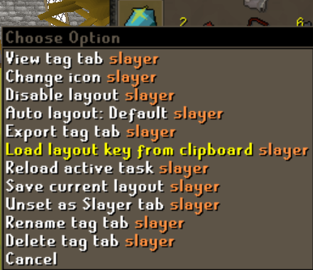</br>
_Step 3: Open the bank. Right-click the designated Slayer tab, then select `Load setup key from clipboard` to load the specified task._

</br>
_Step 4: Open the Slayer tab. The header should now display the loaded task you specified earlier. The bank tab itself should be empty if you have not defined a setup for this task before._

</br>
_Step 5: Right-click the Slayer tab, then select `Save current layout` to project equipment worn and inventory your inventory onto the bank tab._

</br>
_The prepared setup should now be loaded into the Slayer tab_

</details>


### Configuring multiple task tabs using a template


<details>
<summary> 
Click to expand 
</summary>

Example in which an ancient magicks layout is copied and pasted onto another task via the sidebar panel

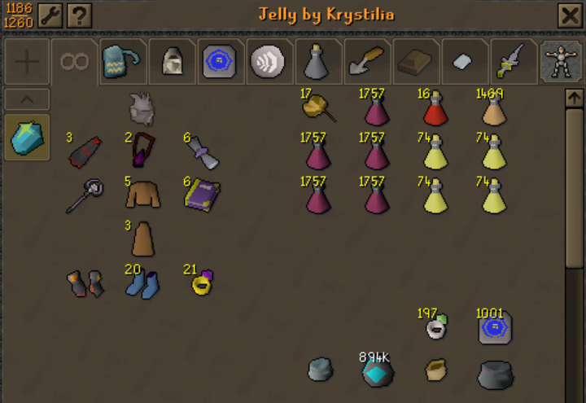</br>
_Step 1: Select a previously defined tab as template to re-use. In this example, Jellies assigned by Krystilia is used as template._</br>

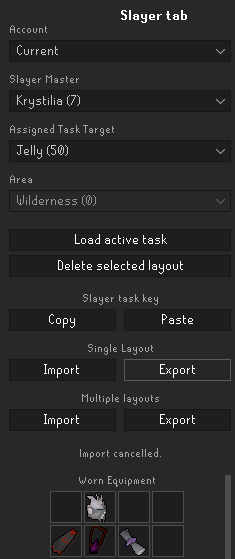</br>
_Step 2: Export the layout using the `Export` button in the `Single Layout` section_</br>

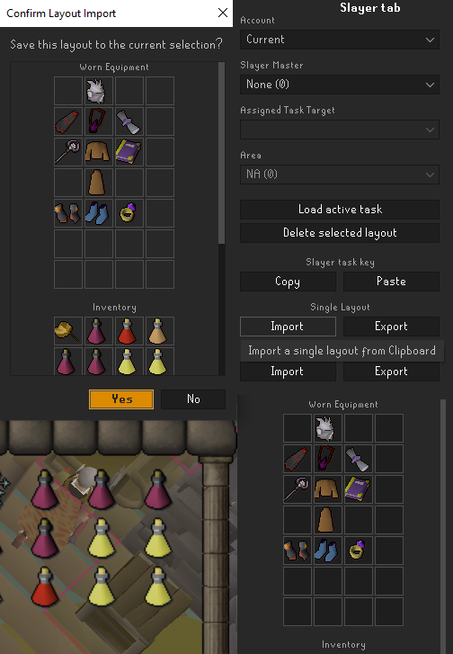</br>
_Step 3: Switch to other task(s) you wish to apply this layout to by altering the comboboxes. 
For each task, import the template layout using the `Import` button in the `Single Layout` section. 
Click `Yes` to confirm._</br>

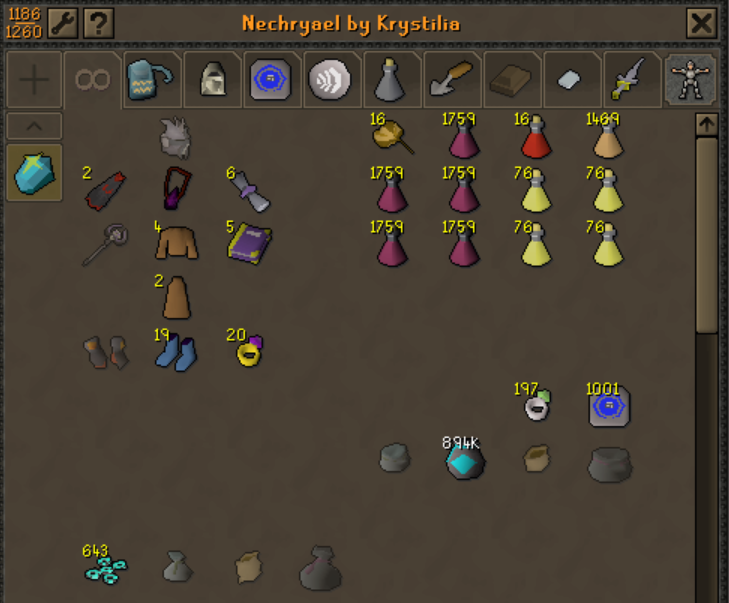</br>
_Step 4: Load one of the imported tabs by copying the key from the sidebar panel and loading it via the Slayer tab right click menu into the Slayer tab. In this example, the Nechryael task by Krystilia was added by importing the Jellies task setup._</br>

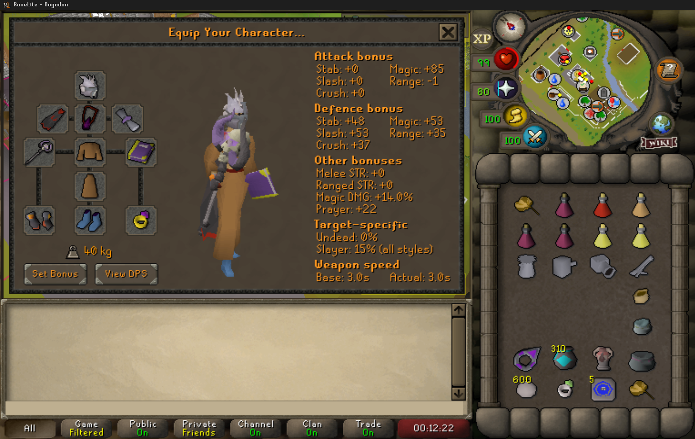</br>
_Step 5: If you wish to modify the setup for a specific task, withdraw the equipment and inventory from the setup and make desired changes. Alternatively, the layout may also be modified by dragging items._</br>

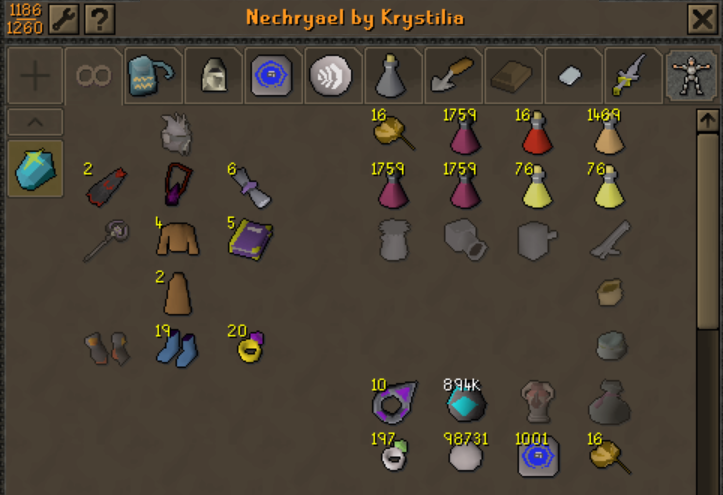</br>
_Step 6 (ONLY when changing the layout by withdrawing equipment/inventory): Save the new setup by right-clicking the slayer tab and selecting `Save current layout`. The updated equipment and inventory should now be loaded into the bank tab._</br>

Steps 3-6 may be repeated for each task that you would like to add based on the template.


</details>


## Setting up a task tab
A layout is generated using the equipment worn and the 28 inventory slots. The generated layout corresponds to both interfaces, with equipment worn on the left and the inventory on the right.
The equipment worn and inventory always span the first 8 rows of the bank after being generated. Subsequent rows are filled with certain items based on the items in the setup that trigger certain rules (see Additional items)
The most straightforward way to generate a layout is to prepare your equipment and inventory like you would when completing the task. A snapshot is then saved to a specific task.
Due to the large amount of unique tasks that may be configured, there are various strategies for configuring layouts.
</br>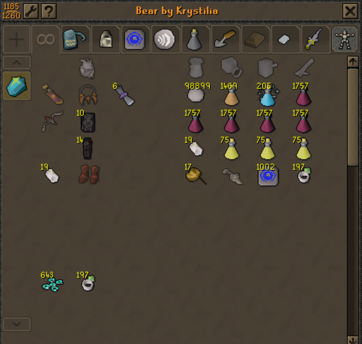</br>

### One task at a time
Plug-and-play; if you want to create a layout for a task whenever it is given simply prepare your loadout as you normally would. </br>
Once you are set to leave, save the setup to the slayer tab by; 
- Right clicking the slayer tab -> `Save current layout`
- Making sure the `autoAssignUndefinedSetups` is checked. This will automatically create a snapshot when you close the bank, provided you have an active task without an existing setup. The cached setup will be saved to the active task after your first KC for the task is made.
- Via the `::createslayersetupcurrent` command (type it and press ENTER); this will generate a layout based on your inventory and equipment worn

If you get  this task assigned again later, the Slayer tab will display the setup you just saved. If you want to check the result, you can view it via the sidebar panel or by opening the slayer tab while the task is still active.
- Anything you forgot during setup can be manually added later, or another setup can be withdrawn and saved.

### Preparing in advance
The sidebar panel can be used to rapidly prepare multiple layouts in advance. 

#### Unassigned task
An unassigned task can be loaded as follows;
1. Use the various comboboxes in the sidebar panel to generate a specific key
2. Copy the key to the clipboard using the `Copy` button in the `Slayer task key` section
3. Right click slayer tab -> select `Load layout key from clipboard`.
    - The Slayer tab will now display the loaded key instead of the active task
4. After preparing equipment and the inventory, the setup can be saved to the tab by right-clicking the slayer tab and selecting `Save current layout`.
- If at some point you wish to switch back to the active task, right click slayer tab -> `Reload active task`
E.g., withdraw a barrage task setup, then load specific tasks that allow for barraging and save the layout.
- This allows you to withdraw your setup once and apply it rapidly to every task this setup may be used.
- Implement small changes like withdrawing gem bag/herb sack inbetween

#### Duplicating existing layouts
Due to the large amount of task combinations and the overlap between many layouts, the sidebar panel has been designed to accommodate configuring many layouts easily.
If you wish to assign a previously defined setup to other tasks, head to the task you wish to copy by setting the comboboxes to the values of the source tab.
- Once a valid combination is given with an existing layout, a preview should appear at the bottom of the panel
- Click on the `Export` button in the `Single layout` section to copy the layout
- Navigate to the task you wish to export this layout to by changing slayer master / task / area values
- Click on the `Import` button in the `Single layout` section
- If you wish to import the displayed setup to that particular task, click yes to confirm
E.g., define a template setup, assign it to a multitude of tasks and fine-tune them later
- If you wish to add niche items like a Bonecrusher/Ash sanctifier, you could add them manually at this point
</br></br>
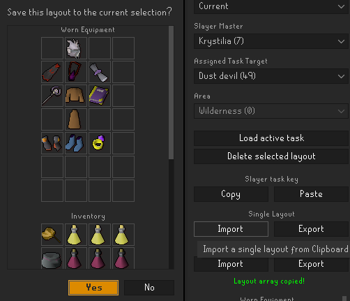</br>
_Preview shown when importing a layout from the clipboard_

#### Importing/exporting layouts
The sidebar panel can also be used to import multiple layouts using the `Import` and `Export` buttons in the `Multiple layouts` section.
Clicking on the export button will open a small interface in which you can select which layouts you wish to export. These layouts will be copied to the clipboard.
When importing layouts, click the import button with an export attached to your clipboard. This will open an interface in which you can select which layouts from this export you wish to import.
After confirming your choice, these layouts will overwrite your existing layouts.
</br></br>
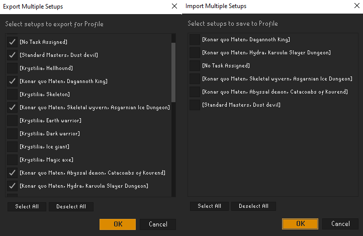</br>
_Menu in which a subset of layouts to export (left) and layouts to import (right) may be chosen_

### Additional items
The section below the automatically generated layout can be filled with extra items. 
These are items that are useful to have within reach while preparing for a slayer task.
It is possible to have items added automatically, based on the items in the inventory/equipment. 
The item mappings text field in the plugin configurations can be used to define such rules.
Each line is dedicated to a specific rule. There are two types of formats;
- Item pairs
  - E.g.;
    ```
    Open herb sack|Herb sack
    ```
  - If itemA is in the generated layout, itemB will be added below, and vice versa.
  - Item pairs, meaning there should be exactly two item names/ids
  - Useful for interchangeable items of which you need one or the other, like an opened and closed looting bag.
- Conditionally mapped items; itemA,itemB,itemC,itemD,...
  - If itemA is in the generated layout, all other items will be added below
  - E.g., 
    ```
    Trident of the seas,Death rune,Chaos rune,Fire rune,Coins
    ```
  - Useful for adding items required to charge the first item of the list without having to include them in the generated setup.
Rules defined above will be applied when generating new layouts or if you manually re-apply the rules. Ideally, these rules should be desired with no exceptions.
</br></br>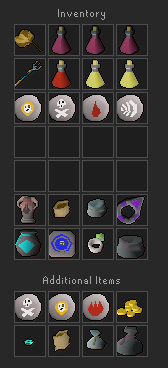</br>
_Automatically added items section based on the inventory; closed/opened container counterparts are added, as well as items to charge a Trident of the seas and an Accursed sceptre._


### Layout
The top 8 rows of a Slayer tab always correspond to the worn equipment + 28 inventory slots. 
Additional items can be added implicitly based on current equipment/inventory items via the plugin configurations.  
Pre-defined additional items are items used for charging items in the inventory, like revenant ether or ancient essence, provided the associated item is present and the configurations allow this.
Additional items are added to the space below the equipment / inventory tab, with a row of space between them.

## Sidebar panel
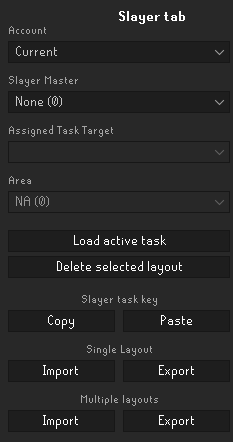</br>
The sidebar panel can be used to manage various layouts. It has a set of comboboxes that can be used to generate specific keys and copy them to the clipboard. 
These keys can then be loaded by right clicking the slayer tab and selecting `Load layout key from clipboard`.
After loading a specific key, the task setup is loaded in the slayer tab as if you have the task assigned. Saving a setup will save it to this particular key instead.
The active task may be reloaded using the `Load active task` option in the menu opened by right clicking the slayer tab.

### Reviewing
The sidebar panel can also be used to review layouts. If a selection is made using the comboboxes, a preview of the layout is displayed in the bottom section of the panel.

### Sharing layouts
The displayed layout may be imported/exported via the `Import` and `Export` buttons, respectively.
Importing a single layout will open a preview pop-up, which can then be accepted or rejected.
Alternatively, layouts can also be transferred in bulk using the `Import` and `Export` buttons in the `Mulitiple Layouts` section. 
When exporting multiple layouts, a selection can be made of existing layouts which you would like to export.
When importing multiple layouts, a similar pop-up screen appears in which you can choose which layouts you wish to import. Imported layouts will overwrite existing layouts.
