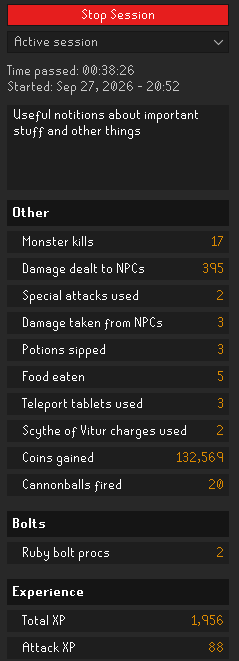

# Activity Counter
A simple counter that counts things like boss KC, agility course laps, slayer tasks completed and skill experience/levels gained in a manually defined session. 
Once a session is started by clicking the button in the sidebar panel, all activity counts covered by the plugin will be tracked and displayed in the sidebar panel. 
Sessions are retained stored locally and will automatically resume when logging in. Once stopped, the session will be archived and can be reviewed by selecting it in the sidebar panel combobox. 
Tracked activities can be hidden on an individual basis via the plugin config or by right-clicking them in the sidebar panel and clicking the hide option. 
The hidden activities/stuff to count can be made visible again by removing it from the list in the plugin configurations.
After a session is closed, it is archived and cannot be resumed. It can also be renamed and you can add notes to describe it. 
The labels at the top that show the time / session start+end / notes can also be hidden. 

## Counted values (267 total)

<b>Boss killcount</b>

- Brutus
- Obor
- Bryophyta
- Scurrius
- Chaos Fanatic
- Deranged Archaeologist
- Crazy Archaeologist
- Scorpia
- Giant Mole
- Shellbane Gryphon
- Grotesque Guardians
- Amoxliatl
- Calvar'ion
- King Black Dragon
- Hespori
- Kraken
- Thermonuclear Smoke Devil
- Spindel
- Dagannoth Prime
- Dagannoth Rex
- Dagannoth Supreme
- Cerberus
- Sarachnis
- Skotizo
- Artio
- Kalphite Queen
- Abyssal Sire
- Royal Titans
- Alchemical Hydra
- Vet'ion
- Venenatis
- Callisto
- Chaos Elemental
- Kree'arra
- Mad Angel
- Commander Zilyana
- General Graardor
- The Hueycoatl
- K'ril Tsutsaroth
- TzTok-Jad
- Zulrah
- Vorkath
- Phantom Muspah
- Maggot King
- Duke Sucellus
- Vardorvis
- Corporeal Beast
- The Whisperer
- The Leviathan
- The Nightmare
- Araxxor
- Nex
- Phosani's Nightmare
- Duke Sucellus (Awakened)
- Vardorvis (Awakened)
- The Whisperer (Awakened)
- The Leviathan (Awakened)
- Demonic Brutus
- Yama
- TzKal-Zuk
- Sol Heredit
- Colosseum waves
- Doom of Mokhaiotl levels
- Doom of Mokhaiotl Level 1-8, 8+ completions

<b>Chests Looted</b>

- Barrows Chests
- Perilous Moons Chests
- Larran's small chests
- Larran's big chests
- Brimstone chests
- Zombie pirate lockers
- Crystal chests
- Elven crystal chests

<b>Other</b>

- Coins gained
- Coins lost
- Gemstone Crab
- Spellbook changes

<b>Clue Scrolls (or sneaky suspicions thereof)</b>

- Completed beginner clue
- Missed beginner clue
- Completed easy clue
- Missed easy clue
- Completed medium clue
- Missed medium clue
- Completed hard clue
- Missed hard clue
- Completed elite clue
- Missed elite clue
- Completed master clue
- Mimic

<b>Slayer Tasks</b>

- Slayer tasks (Other)
- Slayer tasks (Wilderness)
- Slayer tasks (Mortimer)
- Superior spawns
- Slayer points

<b>Agility Courses</b>

- Gnome Stronghold Laps
- Shayzien Laps (Basic)
- Shayzien Laps (Advanced)
- Penguin Laps
- Barbarian Outpost Laps
- Ape Atoll Laps
- Wilderness Laps
- Colossal Wyrm Laps (Advanced)
- Colossal Wyrm Laps (Basic)
- Werewolf Laps
- Prifddinas Laps
- Draynor Village Rooftop Laps
- Al Kharid Rooftop Laps
- Varrock Rooftop Laps
- Canifis Rooftop Laps
- Falador Rooftop Laps
- Seers' Village Rooftop Laps
- Pollnivneach Rooftop Laps
- Rellekka Rooftop Laps
- Ardougne Rooftop Laps
- Agility Pyramid Laps
- Dorgesh-Kaan Laps
- Brimhaven Agility Tickets

<b>Bolt Procs</b>

- Opal bolt procs
- Sapphire bolt procs
- Jade bolt procs
- Pearl bolt procs
- Emerald bolt procs
- Red topaz bolt procs
- Ruby bolt procs
- Diamond bolt procs
- Dragonstone bolt procs
- Onyx bolt procs

<b>Skills</b>

- XP gained
- Levels gained

<b>Raids</b>

- Chambers of Xeric
- Chambers of Xeric: Challenge Mode
- Theatre of Blood
- Theatre of Blood: Story Mode
- Theatre of Blood: Hard Mode
- The Gauntlet
- The Corrupted Gauntlet
- Tombs of Amascut
- Tombs of Amascut: Entry Mode
- Tombs of Amascut: Expert Mode

<b>Minigames</b>

- BA Attacker points
- BA Collector points
- BA Defender points
- BA Healer points
- Jad Challenge 1-6
- Soul Wars wins
- Soul Wars games
- NMZ points
- Pest control points
- Tithe farm points
- Giant's foundry points
- Guardians of the Rift
- Wintertodt
- Zalcano
- Tempoross
- Reward permits

<b>Combat</b>

- Damage dealt to NPCs
- Damage taken from NPCs
- Special attacks used
- Player deaths
- Player kills
- Monster kills
- Max hits

<b>Supplies</b>

- Potions sipped
- Food eaten
- Teleport tablets used
- Cannonballs fired
- Scythe of Vitur charges
- Cannons lost&found

<b>Skilling</b>

- Fish caught
- Logs chopped
- Ore mined
- Bird houses built
- Farming Contracts
- Hunter Rumours
- Mahogany Homes
- Mastering Mixology
	- Completed orders
	- Aga/Lye/Mox points
	- Digweed matured/collected
- Offerings spared
- Bones offered
- Pickpockets succeeded
- Pickpockets failed
- Patches composted
- Seeds planted
- Herbs harvested
- Crops harvested
- Weeds raked
- Fruit picked
- Logs burnt
- Food cooked
- Potions mixed
- Amulet of Chemistry procs
- Crops successfully resurrected
- Crops failed to resurrect
- Bird eggs offered

<b>Achievements</b>

- Achievement Diary tasks
- Quests
- Quest points
- CA Diary tasks
- CA Diary points
- Music tracks unlocked
- New collections logged
- Varrock Museum kudos

<b>Random events</b>

- Drunken dwarf

To-do (maybe)

- Experience drop counters
- Other random events
- Incoming/outgoing hits (miss / not protected / hit)
- Specific Spells cast
- Metrics per timeframe (e.g. medium clues completed/hour)
- Additional categories
- GE tax paid
- Tertiary drops
  - Champion scrolls (and sneaky suspicions thereof)
  - Pets
  - Long/Curved bone
- Reset option
- If you have interesting ideas feel free to make an issue via the plugin page :D

